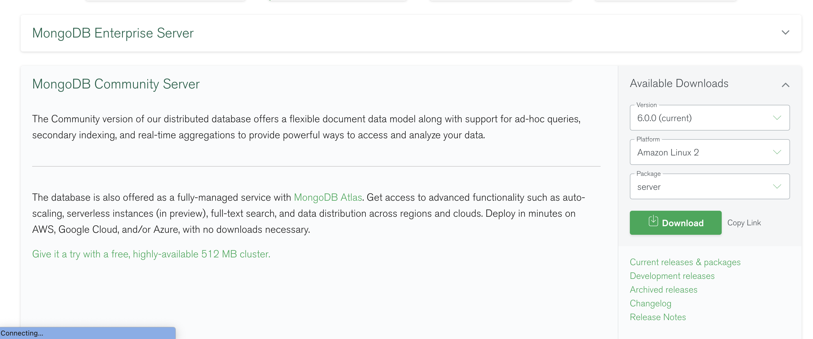
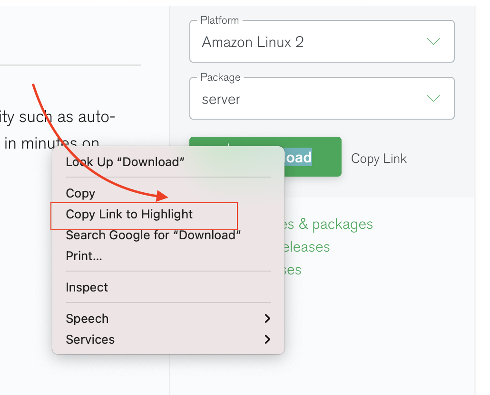
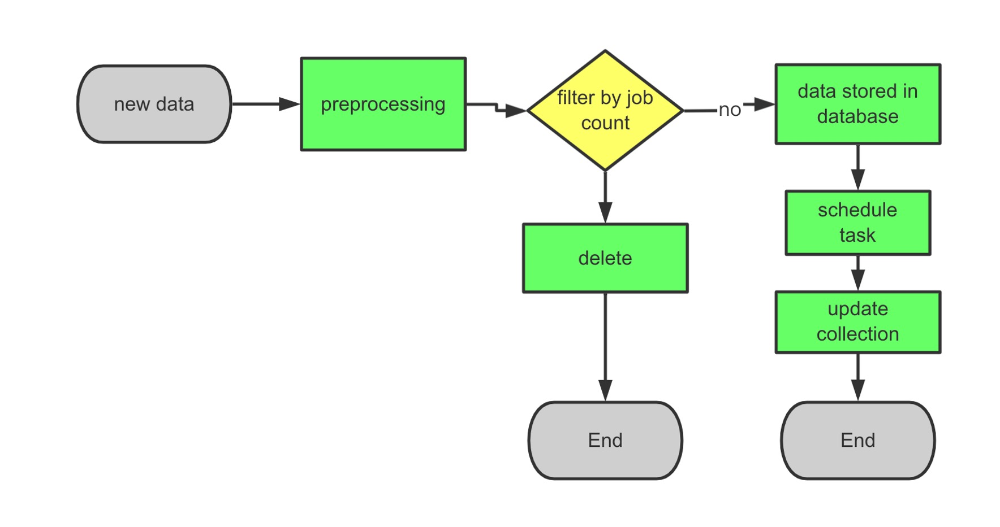

# HKU_Final_Project

#### Django deployment process

##### Install project

1. Download the code.

   

   ```bash
   git clone https://github.com/2022-HKU-Final-Project/back-end.git
   ```

2. Download the dependencies and libraries.

   ```bash
pip install -r requirements.txt
   ```
   
   Requirements.txt contains all the required python package related to django and project.

##### Start server

[Django](https://docs.djangoproject.com/zh-hans/2.0/) default start server port is 8000, if you want to use a different server port, you can use the following command, xxx means the port：

```python
python manage.py runserver xxx
```

After starting server sucessfully, if you use the default server port, you can visit the website from url http://127.0.0.1:8000/


#### Mongodb

##### Create  directory.

```bash
mkdir /usr/local/mongodb
```

##### Download Mongodb

https://www.mongodb.com/try/download/community







The download address below should be replaced according to your environment.

```bash
curl -O https://fastdl.mongodb.org/linux/mongodb-linux-x86_64-amazon2-6.0.0.tgz
```

##### Unzip package

``` bash
tar -zxvf mongodb-linux-x86_64-amazon2-6.0.0.tgz
```


##### Move Mongodb to customed path.

``` bash

mv mongodb-linux-x86_64-amazon2-6.0.0 /usr/local/mongodb
```


##### Set global environment

``` bash
export PATH=/usr/local/mongodb/bin:$PATH
```


##### **Create directory of database**

```bash
cd /usr/local/mongodb
mkdir data
mkdir data/db
mkdir data/logs
touch data/logs/mongodb.log
```


##### Mongodb settings

```bash
cd /usr/local/mongodb/bin
vim mongodb.conf
```

```bash
#指定数据库路径
dbpath=/usr/local/mongodb/data
#指定MongoDB日志文件
logpath=/usr/local/mongodb/logs/mongodb.log
# 使用追加的方式写日志
logappend=true
#端口号
port=27017 
#方便外网访问
bind_ip=0.0.0.0
fork=true # 以守护进程的方式运行MongoDB，创建服务器进程
#auth=true #启用用户验证
#bind_ip=0.0.0.0 #绑定服务IP，若绑定127.0.0.1，则只能本机访问，不指定则默认本地所有IP
 
 
 
```


##### Start service

``` bash
./mongod -f mongodb.conf
```


#### Model

##### Down Code

```bash
git clone git@github.com:2022-HKU-Final-Project/HKU_Final_Project_Model.git
```


##### Requirements

CUDA Version: 11.2  

``` bash
conda install requirements.yaml
pip install -e. simpletransformers
```


##### Training

```bash
python simpletrain.py -m bert
```


##### Deployment

```bash
pip install fastapi
pip install uvicorn
```

```sh
python model_server.py
```

Then, you can use http://localhost:8001/get_info to get recommendation.


#### Coming data processing flow


##### Flow graph




##### Process flow

1. we should execute  the following code to process new data and insert new data into mongodb database. The parameters are explained as follows. 

   ```python
   job_title --- the preprocessed file contains tier1, tier2, tier3 job titles we have generated
   raw_data_path --- new data file path
   save_path --- handled csv file save path
   ```

   

   ```python
   def handle_new_data(job_title, raw_data_path, save_path):
   
       df_data = generate_final_data(job_title, raw_data_path, save_path)
       processed_json = json.loads(df_data.T.to_json()).values()
       mycollect.insert_many(processed_json)
   ```

   

2. After handling new data, we should use the following code to update collections which are represent conclusions drawn from the full table of statistics in mongodb database. The following code has been set as a schedule task, it will execute once a week.

```python
from apscheduler.schedulers.blocking import BlockingScheduler
from Backends.JobQuery import *


def scheduler_monitor():
    scheduler_task = BlockingScheduler()
    scheduler_task.add_job(generate_map, 'interval', days=7, id='test_job1')
    scheduler_task.add_job(generate_salary, 'interval', days=7, id='test_job1')
    scheduler_task.add_job(generate_job_count, 'interval', days=7, id='test_job1')
    scheduler_task.add_job(generate_job_diploma, 'interval', days=7, id='test_job1')
    scheduler_task.start()
```


#for the front-end

###The front-end environment:
1. Download and install node.js from https://nodejs.org.
2. Using 'node -v' to check if it is installed successfully.
3. Using 'npm -v' to check npm version

# technology stack including 'vue' 'cue-router' 'vue-cli' 'less' 'axios' 'lodash' 'es6~7' 'express' 'node-fetch' 'http-proxy-middleware'
4. Install vue.js using 'npm install vue -g'
5. 'npm install -g vue-cli' to install vue-cli.
6. 'npm install -g vue-router' to install vue-router
7.  The same npm methods to install 'less','axis','lodash' 'es6~7' 'express' 'node-fetch' 'http-proxy-middleware'.
8.  If having error 'echarts not exist', npm install echarts


##If you want to run front-end individually:
```bash
npm install
```
### Start server API

```bash
npm run server 
```

### If you modify the front-end, What we need is to compiles and minifies it to the back-end

```bash
npm run build
```

Then add the 'dist' folder to back-end. Relevant routers are written in urls.py under HKU_Project. And views.py is for return data used by front-end.


